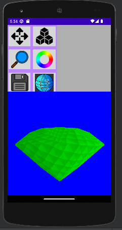

# VoxNet
My voxel Editor made with Koltin and openGL

# Planned features:
1.Edit voxel data by adding and removing singel voxel; (Partly Done!) 
2.Add, move and remove composite objects; 
3.import point cloud to boost your editing; 
4.export your model to games specyfic format; 
  
#

Now this app has new UI.

